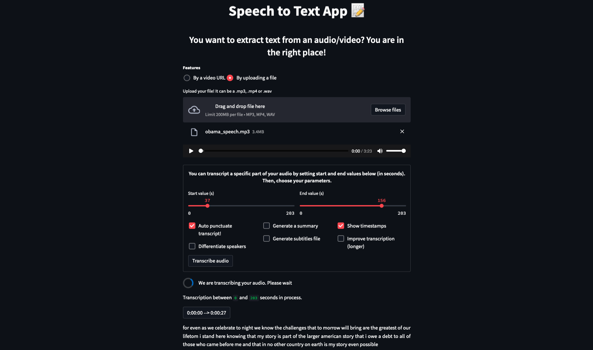

## Speech to text Application using *Python* & *Streamlit* and pre-trained models

This speech to text application is based on 2 [notebook tutorials](https://github.com/ovh/ai-training-examples/tree/main/notebooks/natural-language-processing/speech-to-text/conda) *(Basics and advanced parts)*. To better understand the code, we recommend that you read these notebooks.

### Files description
- `requirements.txt` and `packages.txt` files contain the librairies used by our speech to text app
- `main.py` and `app.py` are the files of the application
- `Dockerfile` allows you to deploy your app
- `download_models.py` is an optional script that allows you to download the models required by our Speech to Text Application and save them in a folder or an Object Storage with AI Deploy.
Storing your models in a folder will save you some time. Indeed, you will not have to download them every time you launch the app!

### Important
If you want the diarization option (speakers differentiation), you will need an access token. This token will be requested at the launch of the application. To create your token, follow the steps indicated on the model page. If the token is not specified, the application will be launched without this feature.

